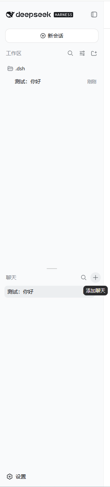
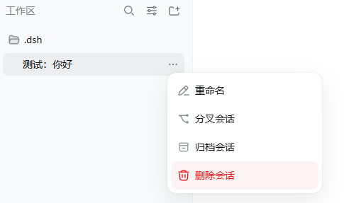
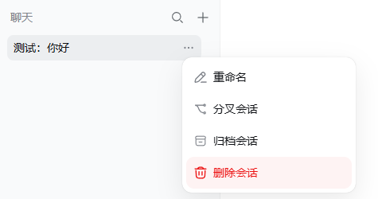
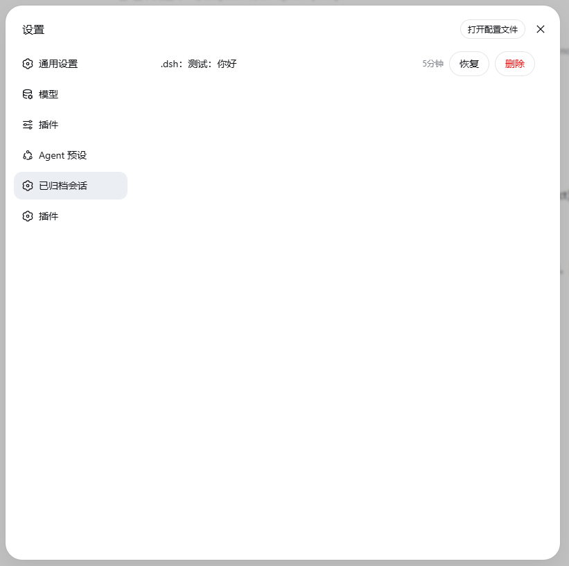

# dsh-chat-manager

DSH 的用户级插件，**Web UI 与桌面端通用**：侧边栏拆成「工作区」「聊天」两块，聊天会话按日期自动建文件夹，会话可以从菜单删除，删掉的会话在设置页里还能恢复或彻底删掉。

## 目录

- [功能特性](#功能特性)
- [版本要求](#版本要求)
- [平台支持](#平台支持)
- [前置依赖](#前置依赖)
- [安装](#安装)
  - [第 1 步：克隆并构建（两种界面共用）](#第-1-步克隆并构建两种界面共用)
  - [第 2 步：装到你用的界面](#第-2-步装到你用的界面)
  - [第 3 步：重启并强刷](#第-3-步重启并强刷)
- [卸载](#卸载)
- [从旧版升级](#从旧版升级)
- [使用说明](#使用说明)
- [数据位置](#数据位置)
- [升级](#升级)
- [开发与验证](#开发与验证)
- [许可证](#许可证)

## 功能特性

- **双区域侧边栏**：左栏上为工作区、下为聊天区，视觉风格一致。工作区保留 DSH 原生的全部行为（搜索、视图选项、拖拽、展开/收起）；聊天区里的会话不要求挂在某个工作区，可以用「添加聊天」新建，也能按标题或内容搜索。

  

- **新会话打开到哪**：焦点在工作区时，开进那个工作区；焦点在聊天会话、或没有焦点时，开进聊天区。

- **聊天文件夹自动归档**：新聊天会话落在系统文档目录的 `DSH/年-月-日/` 下。发出第一句话后，LLM 顺着内容起一个 2–4 个英文小写单词的子文件夹（起不出来时退回本地规则），代理之后的文件读写默认都在这个子文件夹里。日期文件夹本身不会出现在工作区区域。

- **删除会话**：工作区与聊天区的会话菜单都新增了红色「删除会话」（垃圾桶图标，二次确认）。删除会清掉会话日志、工作区账目席位、聊天登记与归档集合引用，但**会话文件夹原样留在磁盘上**，产物不丢。

  

  

- **已归档会话管理**：设置面板新增「已归档会话」，列出会话标题与最近更新时间，可「恢复」（回到原工作区位置）或「删除」（走完整删除流程）。

  

## 版本要求

插件依赖 DSH 0.2 的 bundle 层 + client-modules 装载机制，**要求 DSH ≥ 0.2.0-rc.2**（`package.json` 的 `engines.dsh`；开发对照 0.2.1-alpha.1）。0.2 桌面端与 `dsh web` 跑的是同一套 Web 前端与同一套插件机制，因此插件代码只有一份，桌面端同样可用。

> 从 0.1.x 时代装过插件的，先读「从旧版升级」——仓库目录结构和插件包位置都变了。

## 平台支持

| 平台 | 状态 | 说明 |
| --- | --- | --- |
| Windows | 已实测 | 聊天根取系统「文档」目录（`[Environment]::GetFolderPath('MyDocuments')`）<br>若「文档」被搬到卷根 ACL 里没有 `CREATOR OWNER` 项的卷（例如 `E:\Documents`），新建的聊天文件夹只会继承到「修改」权限，DSH 的 `workspace-write` 沙箱就无法给它写授权，聊天里第一次工具调用会以 `grantWrite(...)` 权限错误失败——**插件会在创建聊天文件夹时（以及启动扫描既有日期文件夹时）自动补上你当前账户的完全控制项**，无需手工修复<br>**插件怎么修**：它读的是文件夹的**安全描述符本身**（SID 与权限，不比对账户名，所以非 ASCII 账户名和代码页都不影响判断），只在**有效**完全控制项确实缺失时才写（正常卷上继承来的完全控制会让它直接跳过、一个字都不写），并回读确认；判断只认**你自己账户的 SID**，如果完全控制只通过某个组（例如 `Administrators`）给到你，插件仍会补一条你自己的完全控制项——这是有意的保守（过滤令牌里的组可能是"仅用于拒绝"的，不能当成证据），而且这条 ACE 只写一次，此后每次检查都会跳过<br>**如果是针对某个组（例如 `Users`、`Everyone`）的显式完全拒绝挡在前面，它会如实报错而不写**（那种情况写自己的允许项也压不过拒绝，得改那个组的权限或换聊天根）<br>每次检查都有超时上限、预算由调用方给定，失败只告警、不会拦住聊天创建。 |
| Linux | 已支持，本机未实测 | 聊天根优先取 `xdg-user-dir DOCUMENTS`；未配置 XDG 用户目录时该命令会返回 `$HOME`，插件识别这种情况并回退 `~/Documents`。删除**当前活跃**的会话会被拒绝（原因见下），重启 DSH 后即可删除。 |
| macOS | 已支持，本机未实测 | 聊天根为 `~/Documents/DSH`。删除活跃会话的规则同 Linux。 |

- **POSIX 上为什么有时删不掉？** DSH 在 Linux/macOS 用会话目录里的 `session.lock`（`flock`）保证「同一会话不被两个进程同时写」。删除会话必须删掉整个会话目录（只删日志文件的话，活跃写句柄会把日志重新写出来），而锁文件就在其中——所以插件在**本宿主仍持有该会话**时直接拒绝删除，并提示「重启宿主后重试」；Windows 的写锁是内核对象、目录里没有锁文件，所以不受影响。另一个已知边界：POSIX 无法探测**别的进程**是否持有同一会话的锁，若你在两个 DSH 实例间共用同一个 `~/.dsh`，删除另一实例正在用的会话仍可能摘掉那个锁文件（Windows 无此问题）。
- **聊天根换个位置**：设置环境变量 `DSH_CHAT_MANAGER_ROOT` 为绝对路径即可（跳过平台「文档」目录解析，例如放在别的盘或没有 XDG 配置的无头环境）。

## 前置依赖

```bash
# Node.js：22.19+（或 24+，DSH 上游的 engines 要求）

# pnpm：DSH 的 plugin 命令会转发给 profile 里的 pnpm
npm install -g pnpm

# DSH CLI（桌面端自带运行时与 CLI，可跳过）
npm install -g @deepseek-ai/dsh
```

## 安装

两种界面各自有**独立的 profile**，需要分别安装：

| 界面 | profile | profile 目录 | 怎么装 |
| --- | --- | --- | --- |
| Web UI（`dsh web`） | `web` | `~/.dsh/profiles/web` | `dsh plugin --profile web add ...` |
| 桌面端 | `desktop` | `~/.dsh/profiles/desktop` | 只能通过桌面端「插件」页 |

### 第 1 步：克隆并构建（两种界面共用）

```bash
git clone https://github.com/tvrpdfe/dsh-chat-manager.git
cd dsh-chat-manager
npm install
npm run build
```

> **仓库根目录就是插件包本身**（`package.json` 声明 `dsh.bundle.patch`），所以之后安装命令直接指向这个克隆目录即可。
> 插件包随仓库分发构建产物 `lib/`，但仍建议自己跑一次 `npm install && npm run build`，保证产物与本机 Node 版本一致。

### 第 2 步：装到你用的界面

**Web UI：**

```bash
dsh plugin --profile web add "link:$(pwd)"
```

（bash 与 PowerShell 里 `$(pwd)` 都会展开成当前目录；也可以用绝对路径，例如 `dsh plugin --profile web add "link:F:/workdir/dsh-chat-manager"`。）

**桌面端：**

桌面端 profile 由 Electron 应用独占管理，CLI 明确拒绝 `dsh plugin --profile desktop ...`（会报 `profile "desktop" is managed exclusively by the Electron application`），所以**只能在桌面端界面里装**：

1. 打开桌面端侧边栏 **插件** 页 → **添加插件**；
2. 输入上面克隆目录的绝对路径（例如 `F:\workdir\dsh-chat-manager`），或直接填 `https://github.com/tvrpdfe/dsh-chat-manager`；
3. 安装完成后**完全退出桌面应用再启动**（宿主半、层装配与客户端 bundle rev 都随进程重启更新）。

> 安装成功的前提是包根目录的 `package.json` 声明了 `dsh.bundle.patch`——本仓库根目录就是插件包，所以直接填仓库地址即可；旧版（插件包在 `packages/` 子目录里）的仓库地址会被判为「这个包没有声明组合包」。

### 第 3 步：重启并强刷

1. **Web UI**：重启宿主进程（`dsh web`），浏览器打开后按 **Ctrl+F5**。
2. **桌面端**：完全退出桌面应用再启动。

（这一步对两端都必要：宿主半、层装配与客户端 bundle rev 都随宿主进程重启更新。）

## 卸载

**Web UI：**

```bash
dsh plugin --profile web remove dsh-chat-manager
```

**桌面端：** 在桌面端侧边栏 **插件** 页找到 `dsh-chat-manager`，删除（CLI 不能操作 `desktop` profile）。

然后在对应界面重启：Web UI 重启 `dsh web`，桌面端完全退出再启动。侧边栏恢复内置 `ui-workspace`。

卸载只摘掉插件层；**聊天文件夹、登记表与归档记录都保留**。

> 桌面端界面被插件搞坏、连插件页都打不开时：设置 → 通用 里有「禁用第三方插件、备份 profile patch 并重启」的恢复入口。

## 从旧版升级

0.1.x 时代的插件有两处不同：插件包在 `packages/dsh-chat-manager/` 子目录里，且用的是旧版 DSH 的装载方式。升级要**先卸旧、再按新路径装**：

```bash
# 1) 拿新源码（旧安装是 link: 指向本克隆的话 git pull 即可）
cd dsh-chat-manager
git pull

# 2) 卸掉旧安装（Web UI；桌面端在桌面端「插件」页里删除）
dsh plugin --profile web remove dsh-chat-manager

# 3) 构建
npm install
npm run build

# 4) 按新的仓库根路径重装（Web UI；桌面端在同一页填仓库根路径）
dsh plugin --profile web add "link:$(pwd)"
```

第 2 步的 `pnpm remove` 偶发在 Windows 上以 pnpm 原生崩溃收场（日志里是一串 exit code 大数字）。这种时候 profile 的 `dependencies` 已经改好了，只差层栈没更新——检查 `~/.dsh/profiles/<profile>/package.json`：`dsh.profile.bundles` 里应当有 `dsh-chat-manager`，没有就手工补进数组末尾（插件管理器平时也是这么写的）。

最后按「第 3 步：重启并强刷」执行一次（Web UI 还要 **Ctrl+F5**）。

## 使用说明

- **新建聊天**：点聊天区头部的「添加聊天」，或焦点在聊天会话/无焦点时点「新建会话」；会话自动落在 `文档/DSH/当天日期/` 下，第一句话后生成 slug 子文件夹。
- **删除会话**：会话「⋯」菜单 → 红色「删除会话」→ 二次确认。删除后行立即消失（不整页刷新），文件夹与其中文件留在磁盘。
- **已归档会话**：设置 → 已归档会话。每行显示「工作区名：会话名」与最近更新时间，可「恢复」或「删除」。
- **聊天区搜索**：标题子串匹配始终可用；**内容命中**依赖部署侧的 `session-query` 索引，若该索引被配置为 `openAt: "never"`（本机当前部署即如此），宿主会记一条 `[dsh-chat-manager] content search failed` 警告并只返回标题匹配，搜索框行为不变。

## 数据位置

| 数据 | 位置 |
| --- | --- |
| 聊天根目录 | `文档/DSH/`（如 `E:\Documents\DSH\`；可用环境变量 `DSH_CHAT_MANAGER_ROOT` 指定为其他绝对路径） |
| 聊天登记表 | 每个日期文件夹内的 `.dsh-chat.json`，形状是 `{ sessions: { sessionId: { slug, folder } } }`<br>（**带 `sessions` 包装**；读侧只认这个形状，手写成无包装的 `{ sessionId: … }` 会被当作空登记表）<br>**写入**是"只改点名那一条"的读-改-写 + **原子替换**（同目录临时文件 `rename` 覆盖，文件戳变了就重做，最多三次），因为 Web 与桌面端两个 profile 会同时读写同一个聊天根<br>启动扫描把各日期文件夹的登记**读进内存**（内存表由此重建；**缺文件就是空表**，文件本身由下一次命名落盘创建，不会开机自动写回）<br>**解析失败**（JSON 坏了）时旧文件另存为 `.dsh-chat.json.corrupt-<时间戳>` 再按空表重建——**被隔离的条目不会自己回来**<br>**读失败**（权限/瞬时锁）则完全不写、只告警<br>启动扫描顺带清掉超过 1 分钟的 `.dsh-chat.json.tmp-*` 残留 |
| 归档集合 / 工作区账目 | `~/.dsh/storages/workspace.json`（workspace 存储域，沿用 DSH 原生机制） |
| 删除墓碑（仅客户端过滤） | 浏览器 `localStorage` 的 `dsh-chat-manager.deletedSessionIds`，基线不再列出后自动清除 |

## 升级

`link:` 装的插件，代码就在你的克隆目录里：`git pull` 后重新 `npm install && npm run build`，再按「第 3 步：重启并强刷」执行（依赖与层注册不用重做）。

## 开发与验证

- 源码用 TypeScript/TSX 维护（`src/`，浏览器半是内置 `ui-workspace` 客户端源码的分叉 + 插件 addon），构建产物为 Harness 加载的 JS bundle：`npm install && npm run build`（esbuild：宿主 ESM + 客户端 `__ModuleLoader__.load` 工厂 bundle）。
- 类型门禁：`npm run verify`（= `npm run typecheck` + 重建 `lib/` + bundle 门禁 + `node --test "test/**/*.test.mjs"`）零错误；产物改动后跑 `node --check lib/index.js lib/client.js`。测试是纯函数决策表（删除工件的平台分叉、Windows DACL 的 SDDL 解析与访问判定、聊天文件夹提示词与首句触发的判定——含被委派的子会话归到父聊天的文件夹），从构建产物导入，因此排在 build 之后。
- 构建：`npm run build` = esbuild 出 `lib/` **+ `node scripts/verify-bundle.mjs` 门禁**
  - **门禁断言**：`lib/client.js` 的 `require` 集合全部落在平台 seed 词内（`react`、`react/jsx-runtime`、`react-dom`、`react-dom/client`、`@deepseek-ai/cordis`、`@deepseek-ai/dsh-client-store`、`@deepseek-ai/dsh-client-ui-slots`、`@deepseek-ai/dsh-client-ui-primitives`、`@deepseek-ai/dsh-client-ui-dockkit`，表只有一份、见 `scripts/platform-seeds.mjs`，构建与门禁共用）
    - **且源码里 import 的每个 seed 词都仍在 require 里**（只判「子集」会在 seed 词被从外部表删掉、整份模块被内联时反而变绿）
    - 不含 0.1.x 图标/hook 名
    - CSS 哈希类名以 `m` 开头，且**逐张样式表**校验「改名后的类必须出现在本表选择器里、不得残留未哈希的 `.local`」（断言只看选择器位置：注释与引号字符串先被剥离，否则注释里的类名会喂饱「必须出现」那条造成假绿；复合选择器只改首个类名会让整条规则失效——行菜单因此曾在鼠标移入时跳到窗口左上角并消失）
    - 工厂 id 等于包名、且该包名确实出现在 `cordis.patch.yml` 里
    - **产物必须比源码新**（任何 `src/**`、`scripts/build.mjs`、`scripts/platform-seeds.mjs`、`tsconfig.json`、`package.json` 比 `lib/*.js` 新即失败并提示重建——门禁只认产物，不会替你重建）。
- 分叉对照：`node scripts/fork-diff.mjs` 把 `src/client/` 与上游 `ui-workspace` 客户端源码逐字节对比，记录写入 `.scratch/std-fork-diffs/`（空 diff = 与上游一致；`_summary.txt` 记下锚定 commit、本次上游 commit 与四类计数）。脚本内置锚定 commit：本机上游检出不在该 commit 上时它以非零退出（`--allow-moved-anchor` = 有意改锚），所以 AGENTS.md 的分叉表不会在上游前进后静默失真；它还把上游平台种子表（`packages/client/web/src/platform.ts` 的 `PLATFORM_MODULES`）与 `scripts/platform-seeds.mjs` 逐项对照，不一致同样非零退出。
- 改完重建 + 重启验证实例：浏览器半改 `src/client/` 后 `npm run build` 重启 dsh（bundle rev 随启动图更新）+ Ctrl+F5；宿主半改 `src/index.ts` 后重启 dsh 即可。
- 真机验证（headless Chrome，可用 `$DSH_CHROME` 指定 Chrome 路径）：`.scratch/` 下的 CDP 探针脚本：
    - boot 探针：无失败页 + 双区域渲染 + 零 console 错误
    - `accept5-menu-mouse.mjs`：真实鼠标滑行下菜单锚定不漂移、可点中「删除会话」
    - `accept6-delete-durable.mjs` + `accept6-phase2.mjs`：设置页删除后磁盘会话目录消失、宿主重启不复活
    - `accept7-row-menu-delete.mjs` + `accept7-phase2.mjs`：**行菜单**上的删除确认（用自建非空白会话，空白行没有动作条）
    - 菜单探针：会话菜单项各出现一次、删除确认框
    - 设置页探针：已归档会话 tab 注册、相对时间渲染
    - 宿主路由探针
    - `accept8-restore.mjs` + `accept8-phase2.mjs`：归档→恢复往返后账本与日志逐项未被触碰、重启后仍在原位
    - `accept9-live-guard.mjs` + `accept9-phase2.mjs`：活跃会话的日志被带外删除后删除请求被拒且不写墓碑，重启后同一幽灵行可删
    - `accept10-chat-folder-acl.mjs` + `accept10-phase2.mjs`：在一个自建的「只继承修改权限」的隔离聊天根上，先量出**修复前**的 `SetNamedSecurityInfoW failed (Win32 5)`（用平台自身的授权代码，对同一个日期文件夹测），再证明插件补权限后同一次授权**成功**、启动扫描能修复既有日期文件夹（探针只在根里有自己写的标记时才整根删除，避免误配覆盖点时删到真实聊天树）
    - `accept11-acl-deny-shapes.mjs`：**不需要宿主**，只用平台授权代码当基准真相，逐条验证五类 ACL 形状（本账户的显式完全拒绝叠在继承完全控制上必须被修好且授权成功；组的完全拒绝必须被如实拒绝且不写，且自己补上那条 allow 也压不过它；只继承修改权限的 `E:\` 形状必须被修好；非 ASCII 路径同样成立；完全控制只经组到手时补的那条 ACE 必须是一次性代价）
    - `accept12-window-check.mjs`：**只读、不需要宿主与浏览器**（可直接对实盘跑），先判「这次能不能判」（该会话确有本人的 `user/message`、日志比产物新——这条只保证可归因，不保证窗口本身没问题），再判聊天会话的**首次**提示词组装是否已带聊天文件夹那一节、日期文件夹根有没有本会话写下的散落文件（插件自己的 `.dsh-chat.json` 及 `.tmp-`/`.corrupt-` 副本不计）
    - 共享 `tools/cdp-lib.mjs`
  - **验证实例要与实盘应用隔离 `$DSH_HOME`**（把 `~/.dsh` 复制成一次性副本、按原名重建一个 junction 再 `DSH_HOME=<副本> dsh --profile cmtest --port 3199 --no-open`），否则两个宿主会互相覆盖同一份 storages
    - `accept10` 还要用 `DSH_CHAT_MANAGER_ROOT` 把聊天根也指向一次性目录，以免动到实盘聊天文件夹的权限。
- 需求与规格：`.scratch/chat-manager/spec.md`；领域词汇：`GLOSSARY.md`；命名时序决策：`docs/adr/0001-chat-folder-naming.md`。

## 许可证

[MIT](LICENSE)（插件包 `package.json` 声明 `license: MIT`）。
